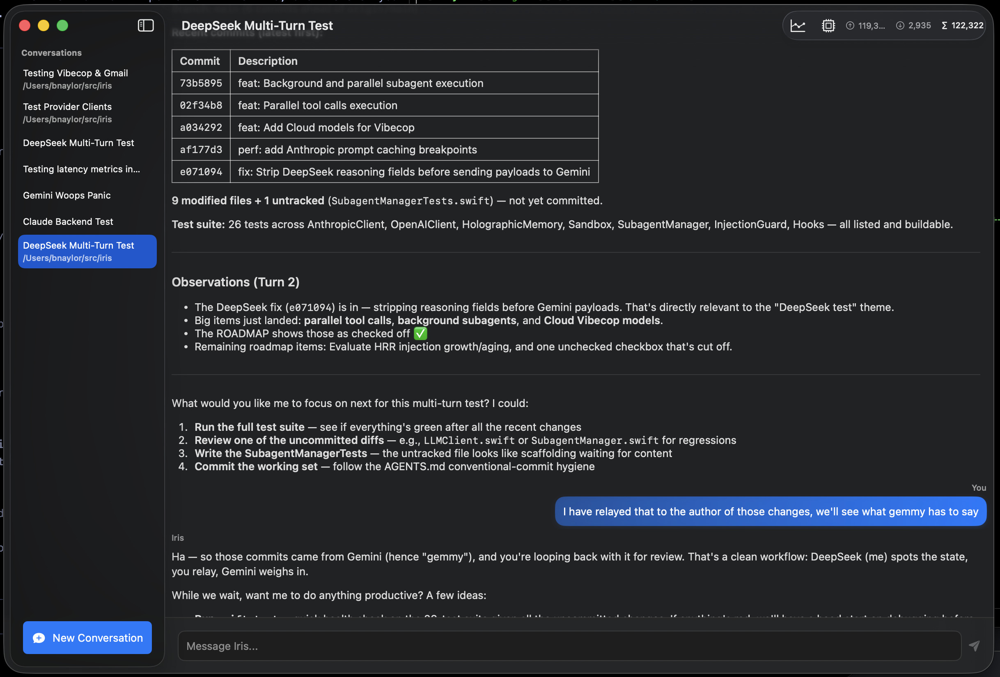
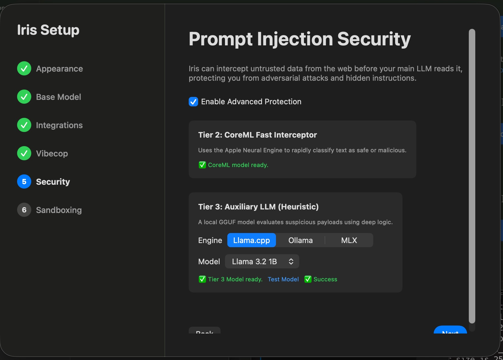

# 🌈 Iris: Native macOS Agent Harness

Iris is a lightweight, compiled, native macOS agent harness designed to run autonomous AI workflows locally without heavy runtime dependencies (like Node/npm) that might be blocked by enterprise endpoint management.

It features **native Model Context Protocol (MCP) support** for limitless tool expansion and **built-in zero-dependency Google Workspace integrations** (Calendar, Docs, Drive, Sheets, Gmail, and Tasks).




## 🚀 Architecture

At its core, Iris is a Swift-based execution chassis that bridges your local environment and cloud LLMs.
*   **Native GUI & Zero-Bloat Foundation:** Built entirely using native Apple frameworks (`SwiftUI`, `Foundation`, `URLSession`, `Network`, `FSEventStream`).
*   **Concurrency:** Built on modern Swift 6 Concurrency (`async/await`, `actor`), providing a high-performance, non-blocking event loop.
*   **LLM Engine:** Natively integrates with Google's Gemini REST API, Anthropic's Claude API, and OpenAI's API. Dynamically translates complex internal agent schemas and tool executions on the fly to support advanced models like `claude-sonnet-5`, `gpt-5.6-sol`, and `gemini-3.5-flash`.
*   **Event-Driven:** Uses an `AsyncStream` wrapper around `FSEventStream` to instantly wake up the agent when files change (e.g., saving a note in Obsidian).
*   **Built-in OAuth:** Includes a dependency-free TCP loopback listener for Google Workspace OAuth, enabling safe, native integrations with **Google Calendar, Docs, Drive, Sheets, Gmail, and Tasks**.
*   **Model Context Protocol (MCP):** Natively acts as an MCP client, dynamically loading external tool servers (like Postgres or SQLite) straight into the agent's brain.
*   **Subagent Sandboxing:** Transparently routes terminal execution through `apple/container` lightweight Linux VMs, allowing Iris to safely execute potentially dangerous autonomous behavior.
*   **Workspace Binding:** Link chat sessions to local filesystem directories. Iris will automatically load the project's `AGENTS.md` instructions and execute terminal commands from within that project context.
*   **Autonomous Scheduling & Wake Recovery:** Register cron-like recurring schedules or one-off interval timers that persist to disk. Features built-in macOS `NSWorkspace.didWakeNotification` observation to guarantee jobs missed during sleep will instantly catch-up when the computer wakes.
*   **Autonomous Goal Loops:** Type `/goal` to kick off a long-running, self-prompting autonomous loop. Iris will continue executing tools and reflecting until the goal is fully accomplished.
*   **Token Tracking & Diagnostics:** Real-time visibility into prompt/candidate tokens, plus a dedicated Diagnostics UI that charts LLM latency metrics across different model tiers and Vibecop requests.
*   **Auxiliary Models Framework:** Native support for local smaller models for background tasks like Vibecop. Supports embedded `llama.cpp` (GGUF weights), local `ollama` daemons, and blazing fast Apple Silicon native inference via `MLX`.
*   **Vibecop Guardian Mode:** An ultra-paranoid AI guardian that evaluates terminal commands and file operations for safety, auto-approving routine actions and escalating dangerous ones to the user. Includes "Always allow" and "Always allow in project" persistence.
*   **Prompt Injection Defense:** Includes a multi-tiered security pipeline (Structural Isolation + Behavioral Canary Probes) to actively neutralize indirect prompt injections hidden within untrusted external data.
*   **Rich Native UI:** Beautiful macOS `NavigationSplitView` with multi-conversation support, `.regularMaterial` frosted glass input bars, and native markdown chat rendering powered by `swift-markdown-ui`.
*   **Active Subagent Monitoring:** A dedicated popover pane to track the real-time status, role, and uptime of concurrently running background subagents. Subagents dynamically self-assign the Easy, Medium, or Hard model tiers based on task complexity.
*   **Markdown Export & Utilities:** Right-click conversations or select specific chat turns to instantly copy them to your clipboard as clean, formatted Markdown. Automatically renames conversations via the `/rename` command.

## 🧠 The Portable Memory & Skill System

Instead of trapping your workflows inside a proprietary database or cloud service, Iris uses the **[Open Knowledge Format (OKF)](https://cloud.google.com/blog/products/data-analytics/how-the-open-knowledge-format-can-improve-data-sharing)** for its memory and skills layer.

*   **Markdown + YAML:** All long-term memories (`USER.md`, `SOUL.md`) and portable skills (`skills/*.md`) are stored as plain Markdown files with strict YAML frontmatter (OKF).
*   **Knowledge Graphing:** Iris automatically cross-links these files using standard Markdown syntax, creating a navigable knowledge graph on your local filesystem.
*   **Memory Grooming:** The background `/reflect` loop actively grooms the memory library, ensuring frontmatter is up-to-date and repairing broken cross-links.
*   **Project Artifacts:** Generated design docs and research notes are strictly organized into human-readable library trees (e.g., `~/.iris/library/<project_name>/`) instead of opaque UUID directories, and all artifacts enforce the OKF schema for seamless integration.
*   **JIT Prompt Injection:** Iris uses `HolographicMemoryManager` to perform semantic vector searches against a fact store that sits in between the working context and the static library of markdown "memories" and skills.

### Core Native Tools
Iris provides some native primitives to the LLM:
1.  `run_command`: Sandboxed execution of shell commands (runs in a lightweight Linux VM via `apple/container` if sandboxing is enabled).
2.  `read_file`: Reads arbitrary local text files.
3.  `write_file`: Writes/modifies local files.
4.  `schedule_job`: Native API to register cron-like schedules (`minute`, `hour`, `weekday`) or `intervalSeconds`.
5.  `set_workspace`: Automatically binds the active conversation to a project path.
6.  `reflect`: Internal tool allowing the agent to write down its reasoning, plans, and self-evaluations during complex loops.
7.  `goal_complete`: Escapes an active autonomous `/goal` loop.

## 🛠️ Usage

When started, Iris launches as a native macOS App. If you haven't configured your API keys or authentication method, the **Settings Window** will automatically pop up. 
All keys are saved securely to your local Keychain and `UserDefaults`. Gemini supports both standard API Keys and **Application Default Credentials (ADC)** via `gcloud`. See [docs/Google_ADC_credentials.md](docs/Google_ADC_credentials.md) for step-by-step setup and GCP project configuration.

```bash
swift run
```

### Global Hotkey ⌨️
Iris runs in the background and can be summoned instantly over any other app by pressing **`Cmd + Shift + Space`** (configurable in Settings).

### Google Workspace Integration 🔐
In the settings window, you can enter your Google OAuth Client ID and Secret, and click **Connect to Google**. Iris will spin up a local listener, redirect you to Google for consent, and seamlessly exchange your authorization code for valid access and refresh tokens.

Once connected, Iris has native API access to the following Workspace tools directly from Swift:
*   **Google Calendar**: `google_calendar_list_events`, `google_calendar_create_event`
*   **Google Docs**: `google_docs_get`
*   **Google Drive**: `google_drive_search`
*   **Google Sheets**: `google_sheets_get`
*   **Google Tasks**: `google_tasks_list_tasklists`, `google_tasks_list_tasks`, `google_tasks_create_task`
*   **Gmail**: `gmail_list_unread`, `gmail_send_email`

## 🛡️ Vibecop Guardian

Iris includes a reimplementation of [**Vibecop**](https://github.com/bnaylor/vibecop), an independent, paranoid AI guardian (using an auxiliary local model) that evaluates every single terminal command or file operation proposed by the primary agent. 

*   **Auto-Approval**: If the command is completely routine and safe, Vibecop approves it silently, saving you from prompt fatigue.
*   **Guardian Mode**: You can run `/vibecop init` in any workspace. The primary agent will analyze your project and generate a custom `.iris/vibecop.md` file. Vibecop uses this as its system prompt, learning what commands are normal *specifically for this project* (e.g., `go build` is safe here, but `npm` should trigger an escalation).
*   **Escalation**: If the command is destructive, touches restricted paths, or isn't listed in the Guardian config, Vibecop blocks it and escalates to a user confirmation dialog.

## 📦 Project Setup

Iris is managed via Swift Package Manager (SPM).
To build:
```bash
swift build
```

### Model Context Protocol (MCP)

Iris natively supports the [Model Context Protocol (MCP)](https://modelcontextprotocol.io/). 

To configure MCP servers, create a JSON file at `~/.iris/mcp_servers.json` with your server configurations:

```json
{
  "postgres": {
    "command": "npx",
    "args": ["-y", "@modelcontextprotocol/server-postgres", "postgresql://localhost/mydatabase"]
  },
  "sqlite": {
    "command": "uvx",
    "args": ["mcp-server-sqlite", "--db-path", "~/mydatabase.db"]
  }
}
```

Once configured, Iris will automatically boot these servers in the background and their tools will be available for Iris to use.

## 💡 Inspiration

A key bit of Iris's agentic workflow is heavily inspired by the philosophy of [obra/superpowers](https://github.com/obra/superpowers). In particular, we natively enforce the following principles in the agent's system prompt:
*   **Brainstorming First:** The agent must explore context, ask clarifying questions, and propose trade-offs before writing a single line of code.
*   **Design Docs (Specs):** Designs must be presented and approved, then written to `specs/` directories.
*   **Implementation Plans:** Complex designs are broken down into step-by-step plans.
*   **Test-Driven Development (TDD):** The "Iron Law" of testing first. No production code is written without observing a failing test first (RED -> GREEN -> REFACTOR).
*   **Execution Loop:** Implementing code iteratively and reviewing it until the feature matches the specs.
