# Native Swift Holographic Memory: Design & Architecture

## Motivation

Modern local AI agents require robust, long-term memory systems to augment their working context. Existing approaches (like Hermes' Holographic memory) often rely heavily on Python and NumPy to handle the complex vector algebra required for Holographic Reduced Representations (HRR). 

For a native Swift agentic harness targeting Apple Silicon, pulling in a bulky Python runtime or deploying local microservices introduces unacceptable overhead. Our goal is to build a **dependency-free, pure-Swift** Holographic Memory subsystem that leverages Apple's hardware-accelerated math libraries (`Accelerate`) and an embedded database (`SQLite`) to achieve blazing fast, on-device recall.

## High-Level Architecture

The memory layer serves as an intermediary between the agent's short-term "working context" and the long-term markdown storage. It operates on a **Just-In-Time (JIT)** retrieval model.

```mermaid
flowchart TD
    A[Agent Working Context] -->|Extracts Fact| B(Fact Extraction & Trust Scoring)
    B --> C{HRR Vector Encoding}
    
    subgraph Native Swift Holographic Memory
        C -->|Accelerate/vDSP| D[(SQLite via GRDB)]
        D -.->|FTS5 Keyword Index| D
        D -.->|Vector Blob Storage| D
    end
    
    D -->|Ranked Retrieval| E[JIT Context Injection]
    E --> A
    
    D -->|Periodic Archival| F[Markdown File Library]
```



## Core Technologies

1. **`Accelerate` (`vDSP`)**: Replaces NumPy. A highly optimized, C-based digital signal processing library built into macOS/iOS. It uses Apple Silicon's SIMD (Single Instruction, Multiple Data) instructions to perform array operations (dot products, convolutions, additions) in microseconds.
2. **`GRDB.swift`**: A robust, fast, and modern SQLite toolkit for Swift. We use it to interact with the local database file safely via Swift structs and Codable.
3. **`SQLite FTS5`**: A built-in SQLite extension that provides incredibly fast Full-Text Search over our factual data, allowing us to combine keyword matching with holographic vector similarity.

## Holographic Reduced Representations (HRR) in Swift

HRR allows us to encode structures (like "User likes Python" or "System IP is 10.0.0.1") into fixed-length vectors (e.g., N=1024) using vector algebra. 

We map traditional Python/NumPy HRR operations directly to native Swift `vDSP` routines:

### 1. Vector Generation & Superposition (Addition)
Facts and roles are randomly generated arrays of floating-point numbers distributed normally. Superposition (combining concepts without order, like an unordered set) is just element-wise addition.
* **NumPy**: `c = a + b`
* **Swift**: `vDSP_vadd(a, 1, b, 1, &c, 1, vDSP_Length(n))`

### 2. Binding (Circular Convolution)
Binding groups two vectors together to create a new, distinct concept (e.g., Role: `Language` bound to Value: `Swift`). Circular convolution is the standard HRR binding operation.
Instead of raw `O(N^2)` convolution, it is exponentially faster to use the Fast Fourier Transform (FFT).
* **Algorithm**: `IFFT(FFT(A) * FFT(B))`
* **Swift**: We use `vDSP_fft_zrip` to transform both vectors to the frequency domain, multiply them with `vDSP_zvmul`, and transform them back. This runs in near-zero time on Apple Silicon.

### 3. Similarity (Cosine Similarity / Dot Product)
To find relevant facts, we compare the query vector against stored vectors. Because HRR vectors are typically normalized, dot product is equivalent to cosine similarity.
* **NumPy**: `np.dot(a, b)`
* **Swift**: `vDSP_dotpr(a, 1, b, 1, &result, vDSP_Length(n))`

## Database Schema

We define a relational SQLite schema to hold our facts and their semantic representations. Vectors are serialized to contiguous `Data` blobs.

```sql
CREATE TABLE facts (
    id TEXT PRIMARY KEY,
    content TEXT NOT NULL,
    hrr_vector BLOB NOT NULL,     -- The N-dimensional float array
    trust_score REAL DEFAULT 1.0, -- Dynamic trust based on reinforcement
    timestamp DATETIME DEFAULT CURRENT_TIMESTAMP
);

CREATE VIRTUAL TABLE facts_fts USING fts5(
    content,
    content='facts',
    content_rowid='rowid'
);

CREATE TABLE fact_relations (
    source_id TEXT REFERENCES facts(id),
    target_id TEXT REFERENCES facts(id),
    relation_type TEXT, 
    weight REAL DEFAULT 1.0,
    PRIMARY KEY (source_id, target_id)
);
```

## The Just-In-Time Retrieval Pipeline

When the agent requires context (e.g., the user asks a question about a past configuration):

1. **Candidate Generation (Lexical)**: Execute an FTS5 search against SQLite to rapidly pull a subset of candidate facts matching the keywords.
2. **Holographic Similarity (Semantic)**: The query string is encoded into an HRR vector. We extract the `hrr_vector` BLOBs of the candidates, convert them back to `[Float]`, and run `vDSP_dotpr` against the query vector.
3. **Hybrid Ranking Algorithm**: We blend the scores together in memory:
   $$ \text{Rank} = (W_{hrr} \times \text{Similarity}) + (W_{trust} \times \text{Trust Score}) + (W_{time} \times \text{Recency Reciprocal}) $$
4. **Context Injection**: The top $K$ facts are formatted and injected invisibly into the LLM's prompt window.

## Conclusion

By swapping NumPy for Apple's `Accelerate` framework, we achieve the holy grail for a local, macOS-first agentic harness: a highly sophisticated, mathematically sound Holographic Memory system that compiles natively into a single lightweight Swift binary. It is offline, entirely private, and astonishingly fast.
